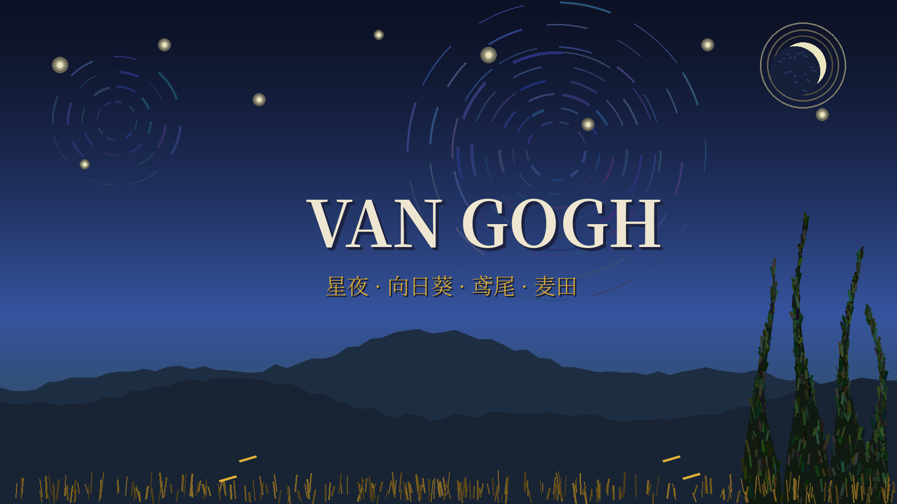

# Van Gogh (梵高) — Omarchy Theme

A fine-art dark theme for [Omarchy](https://omarchy.org), distilled from Vincent van Gogh's masterpieces: *The Starry Night*, *Sunflowers*, *Irises*, *Wheat Field with Cypresses*, and *Wheatfield with Crows*.

Live under a swirling cobalt sky and work in a field of wheat gold — the palette is built on the same complementary clash of **Starry Night cobalt vs. wheatfield gold** that Van Gogh used in his 1890 Auvers landscapes.



## Install

```bash
omarchy theme install https://github.com/hongyangchun/omarchy-vangogh-theme
```

Or from the desktop: `Super + Alt + Space` → **Install** → **Style** → **Theme**, then paste the repository URL above.

To activate:

```bash
omarchy theme set vangogh
```

## Design Philosophy

- **Background & Canvas (`#0d1226`, `#090d1d`)**: The midnight cobalt of *The Starry Night* (星夜深蓝), deepened toward the zenith of the *Wheatfield with Crows* night sky.
- **Foreground & Text (`#eee6d0`, `#faf4e4`)**: Wheat cream and moonlight white (麦田奶油 / 月光米白) — the warm light Van Gogh set against his blues.
- **Primary Accent (`#e6b23c`)**: **Sunflower / wheat gold** (向日葵黄 · 麦田金) — petal gold from the Sunflowers series and the harvest amber of the Auvers wheat fields.
- **Secondary Accent (`#3f6acc`)**: **Starry Night cobalt** (星夜钴蓝) — the unmistakable swirling sky.
- **Hyprland Dual-Tone Active Gradient**: `rgba(e6b23cee) rgba(3f6accee) 45deg` — a 45° sweep from wheat gold into cobalt blue, gold field meeting night sky.
- **Supporting cast**: cypress earth green (柏树墨绿), iris leaf green and violet shadow (鸢尾叶绿 / 紫影), and the rust red of Van Gogh's signature (落款锈红).
- **Muted & Selection (`#20305c`, `#7d8698`)**: Deep cobalt selection and swirling night haze.

## Palette Reference

| Token | Hex | Aesthetic |
|---|---|---|
| `background` | `#0d1226` | 星夜深空 (Starry Night midnight) |
| `dark_background` | `#090d1d` | 罗纳河夜色 (Night over the Rhône) |
| `darker_background` | `#060913` | 乌鸦夜空 (Crows-sky zenith) |
| `lighter_background` | `#1a2440` | 钴蓝云层 (Lifting cobalt cloud) |
| `foreground` | `#eee6d0` | 麦田奶油 (Wheat cream) |
| `bright_foreground` | `#faf4e4` | 星芒亮白 (Star-halo white) |
| `accent` | `#e6b23c` | 向日葵黄 · 麦田金 (Sunflower / wheat gold) |
| `selection` | `#20305c` | 星夜深蓝 (Deep cobalt selection) |
| `muted` | `#7d8698` | 夜空雾蓝 (Night haze grey-blue) |
| `red` | `#b3543c` | 落款锈红 (Signature rust red) |
| `orange` | `#cc8a3a` | 麦熟琥珀 (Harvest amber) |
| `yellow` | `#e6b23c` | 向日葵黄 (Sunflower petal gold) |
| `green` | `#6f8f5a` | 鸢尾叶绿 (Iris leaf green) |
| `cyan` | `#5a9a9a` | 星涡青 (Night-swirl teal) |
| `blue` | `#3f6acc` | 星夜钴蓝 (Starry Night cobalt) |
| `magenta` | `#8a6a9e` | 鸢尾紫影 (Iris violet shadow) |
| `brown` | `#6a5238` | 柏树土褐 (Cypress earth brown) |

## Wallpapers (Backgrounds)

Eight public-domain masterpieces, high-resolution scans from Wikimedia Commons:

1. `01-starry-night.jpg` — 《星月夜》*The Starry Night* (1889, MoMA) — 3840×3041
2. `02-wheat-field-with-cypresses.jpg` — 《麦田与柏树》*Wheat Field with Cypresses* (1889, The Met) — 3112×2448
3. `03-irises.jpg` — 《鸢尾花》*Irises* (1889, Getty Museum) — 3840×2935
4. `04-wheatfield-with-crows.jpg` — 《乌鸦群飞的麦田》*Wheatfield with Crows* (1890, Van Gogh Museum) — 3508×1669
5. `05-almond-blossom.jpg` — 《盛开的杏花》*Almond Blossom* (1890, Van Gogh Museum) — 3139×2480
6. `06-starry-night-over-the-rhone.jpg` — 《罗纳河上的星夜》*Starry Night Over the Rhône* (1888, Musée d'Orsay) — 3840×2976
7. `07-the-bedroom.jpg` — 《在阿尔勒的卧室》*The Bedroom* (1888, Art Institute of Chicago) — 3840×2997
8. `08-the-night-cafe.jpg` — 《夜间咖啡馆》*The Night Café* (1888, Yale University Art Gallery) — 3840×3031

Cycle wallpapers:

```bash
omarchy theme bg next
```

Or open the graphical selector:

```bash
omarchy theme bg-switcher
# Shortcut: Super + Alt + W
```

### Image credits

Van Gogh's paintings are in the **public domain** (artist died 1890). The wallpapers are faithful photographic reproductions of the paintings sourced from [Wikimedia Commons](https://commons.wikimedia.org), each marked "Public domain":

- [*The Starry Night*](https://commons.wikimedia.org/wiki/File:Van_Gogh_-_Starry_Night_-_Google_Art_Project.jpg) — Google Art Project scan
- [*Wheat Field with Cypresses*](https://commons.wikimedia.org/wiki/File:Vincent_van_Gogh_-_Wheat_Field_with_Cypresses_-_Google_Art_Project.jpg) — Google Art Project scan
- [*Irises*](https://commons.wikimedia.org/wiki/File:Irises-Vincent_van_Gogh.jpg)
- [*Wheatfield with Crows*](https://commons.wikimedia.org/wiki/File:Vincent_van_Gogh_-_Wheatfield_with_crows_-_Google_Art_Project.jpg) — Google Art Project scan
- [*Almond Blossom*](https://commons.wikimedia.org/wiki/File:Vincent_van_Gogh_-_Almond_blossom_-_Google_Art_Project.jpg) — Google Art Project scan
- [*Starry Night Over the Rhône*](https://commons.wikimedia.org/wiki/File:Starry_Night_Over_the_Rhone.jpg)
- [*The Bedroom* (Art Institute of Chicago version)](https://commons.wikimedia.org/wiki/File:Vincent_van_Gogh_-_The_Bedroom_-_Google_Art_Project.jpg) — Google Art Project scan
- [*The Night Café*](https://commons.wikimedia.org/wiki/File:Le_caf%C3%A9_de_nuit_(The_Night_Caf%C3%A9)_by_Vincent_van_Gogh.jpeg) — Yale University Art Gallery scan

## Typography & Fonts (字体搭配)

- **Terminal & Code**: `Maple Mono NF CN` or `JetBrainsMono Nerd Font`.
- **UI & Titles**: `Noto Serif CJK SC` pairs well with the painterly, classical mood.
- Switch system font anytime:

```bash
omarchy font set "Maple Mono NF CN"
```

## Switching & Reverting (主题切换与撤回)

### Activate Van Gogh:

```bash
omarchy theme set vangogh
```

### Revert to Another Theme:

Switching back is instant and non-destructive:

```bash
omarchy theme set "Black Myth Wukong"
# or
omarchy theme set "Cyberpunk 2077"
```

## Icons

Defaulted to `Yaru-wartybrown-dark` — warm earthy tones that sit well against the cobalt-and-gold palette.

## License

MIT — see [LICENSE](LICENSE). The bundled paintings are public-domain artworks by Vincent van Gogh (1853–1890); photographic reproductions courtesy of Wikimedia Commons and the Google Art Project.

---

> *"I dream my painting and I paint my dream."* — Vincent van Gogh
